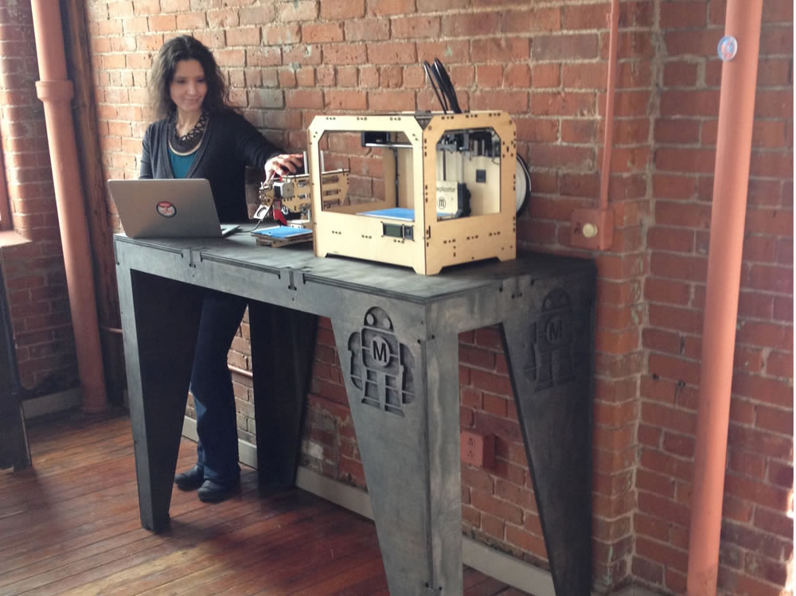
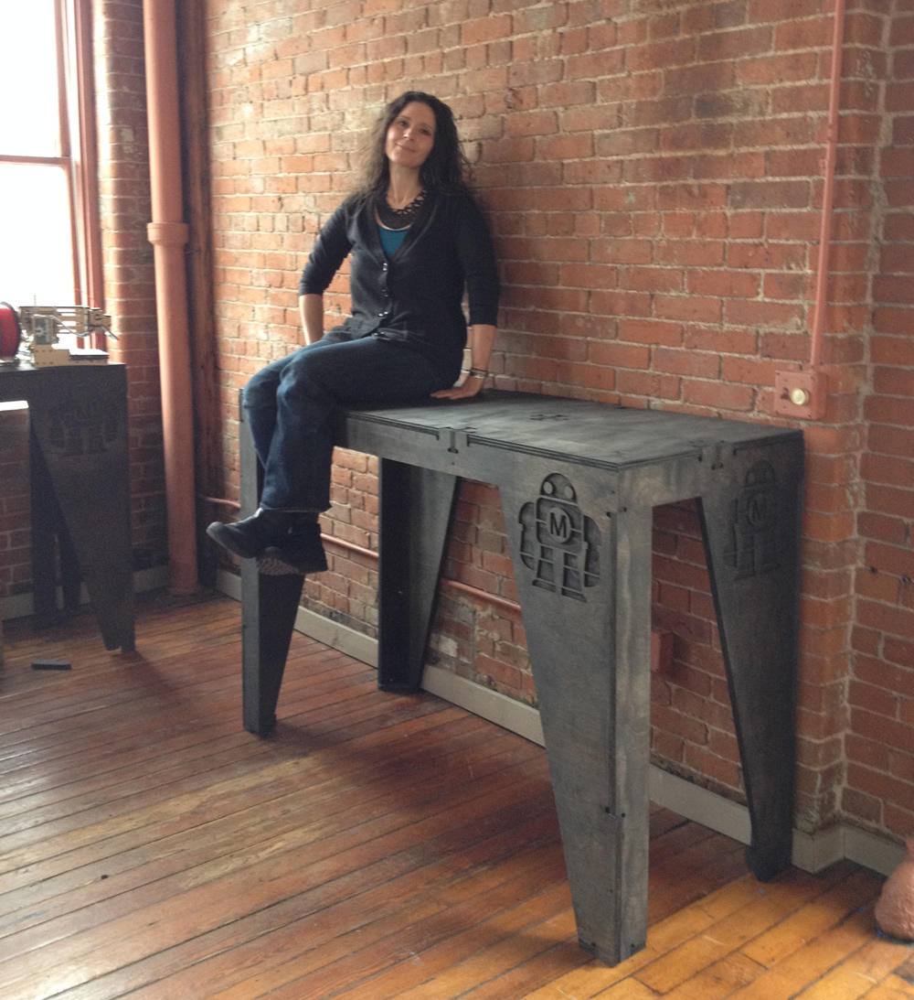

CNC Maker Bench
=============================
This repo contains supplemental material for my MAKE tutorial, "CNC Maker Bench" (http://makezine.com/cnc-maker-bench), which also appeared in MAKE magazine vol. 38 (http://makezine.com/volume/make-38-cameras-and-av/). The tutorial explains how to build an customized standing height workbench using a CNC router and AtFab's (http://atfab.co) 'One to Several' parametric Processing table configuration app. 

Available Files
-----------------------------
VECTORS: 
The CNC Maker Bench configuration is available in several vector formats: DXF, EPS and AI. CRV files to be added shortly. 

PROCESSING APP: 
The One to Several app is provided with the permission of AtFab and Filson and Rohrbacher (http://filson-rohrbacher.com).

LICENSE: CC BY-NC-SA 4.0
-----------------------------
The AtFab "One to Several" app is licensed under a CC BY-NC-SA 4.0 License (http://creativecommons.org/licenses/by-nc-sa/4.0/).

In accordance with AtFab’s license, the CNC Maker Bench files created by Anna Kaziunas France are also licensed under a CC BY-NC-SA 4.0 License. 

COMMERCIAL LICENSING
-----------------------------
Permissions beyond the scope of this license for the One to Several Table App may be available from AtFab. If you would like to use the One to Several Table App in a commercial context, contact Filson and Rohrbacher (http://filson-rohrbacher.com) 

